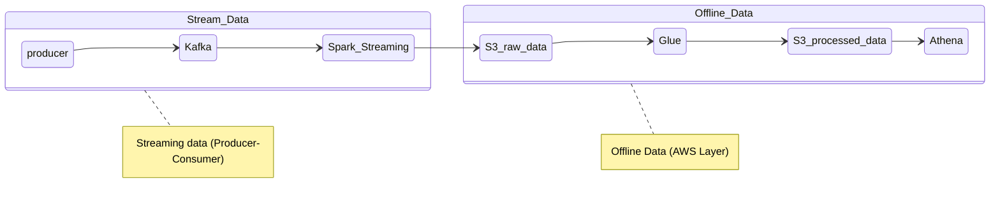
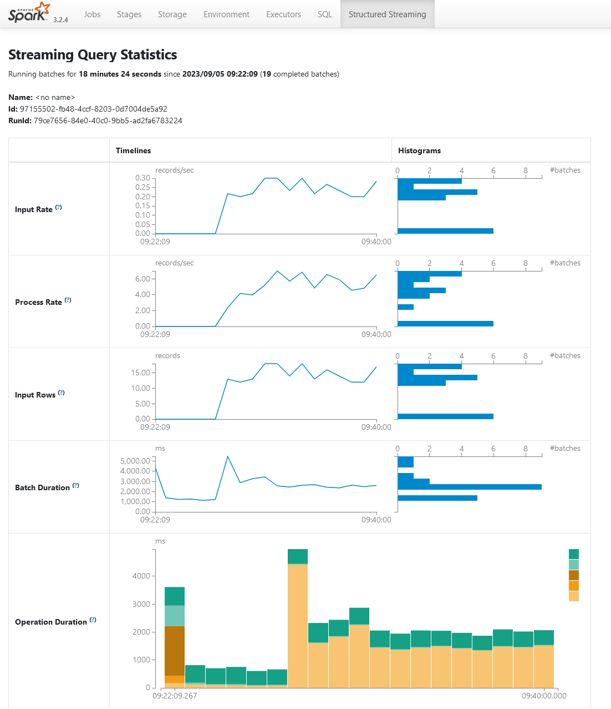
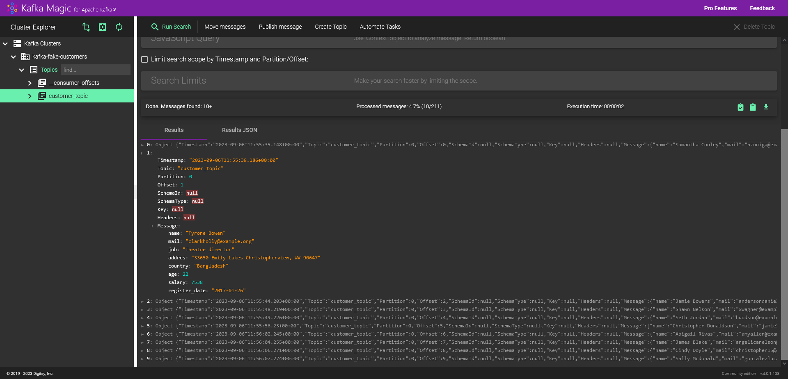

## Intro to streaming data with Kafka, Spark and AWS Glue

In this scenario, data arriving periodically from the source is sent to Kafka and transferred to Spark from there. In Spark, data is simply processed and written to S3 in parquet format. Finally, the written raw data is written back to S3 as a single file in parquet format with Glue and transferred to Athena as a table.

Detailed blog post: [Stream Veriye Giriş: Kafka, Spark ve AWS Glue ile Küçük Veri İşleme](https://silverstone1903.github.io/posts/2023/09/stream-101/) (Turkish)

----

### Project Pipeline

### Frameworks & Versions
* Python 3.7.12
* Spark 3.2.4
* Hadoop 2.7.4
* Kafka 3.5.1

### Screenshots
Spark Structured Streaming UI

[Kafka Magic](https://www.kafkamagic.com/): Monitoring for Apache Kafka topics

### Resources
* [kafka-python](https://kafka-python.readthedocs.io/en/master/)
* [Introduction to Kafka](https://docs.confluent.io/kafka/introduction.html)

